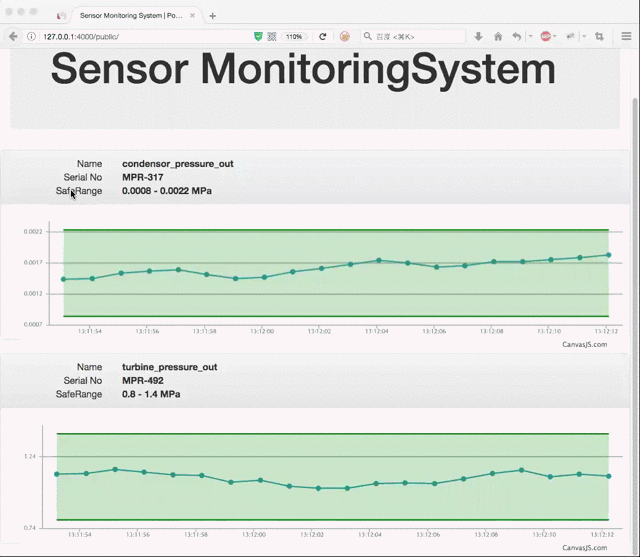

# SensorMonitor System
SensorMonitor is a distributed monitoring system. which can be used for sensor-like system's monitoring. It gathering sensor's data and persisting the data into database, and also sending data to web client(browser) using WebSocket simultaneously.


## Install and Setup

### Setup RabbitMQ and PostgreSQL
Installing RabbitMQ and start it.
Import the sql file `postgres_db.sql` into distributed database.
Create a user that `datamanager` and `webapp` service will using.

### Start The Service

#### Development Environment Setting
1. Add this to your `~/.bash_profile`
```
export GOPATH=~/golang
export GOPATH=$GOPATH:~/sensorMonitor
export PATH=$PATH:/usr/local/go/bin
export PATH=$PATH:$GOPATH/bin
```
2. Enable it
```
source ~/.bash_profile
```

#### Using go run command start the service
```
cd ~
git clone https://github.com/sensorMonitor/sensorMonitor
cd sensorMonitor
```
edit the `db.go` file in `datamanager` and `webapp` service, to make sure you have priviledge
to access dababase.
then start the service:
```
./start_sensors.sh
./start_coordinator.sh
./start_datamanager.sh
./start_webapp.sh
```
or you can building all these executable files:
```
./build.sh
```
the output exec files will in `./bin` directory.


## Architecture

### Main Data Streaming
`Sensor` generates data and sending it to its own data queue in RabbitMQ, `coordinator` consume the data queue and publishing all sensors data into `PersistReading` queue for `datamanager` to store into database, `coordinator` also publishing all the data into `WebappReadingsExchange` exchange and the webapp server will sending the data in it to web client(browser).

Main Data Streaming
```
sensor --> coordinator --> datamanager --> database(PG)
                |
                |---> webapp server --> browser(JavaScript)      
```
Persisting data

```


            |      |    RabbitMQ     |           

coordinator | -->  |  PersistReading |   -->   datamanager     -->  PG

            | <--  |   dataQueue1    |
            | <--      dataQueue2                 
            | <--  |   dataQueue3    |
                        ...

```


### Automatic Discovery
The sensors and coordinators can recognize each other whenever anyone of them is start up.
When `webapp` start up, all coordinators will know they are coming and sending
all sensors name to it.
Web client(browser) will receive sensor's information from webapp server and decide which sensor's data will be showing in browser.

### Automatic Discovery Implementing

sensor and coordinator
```
       |       |       RabbitMQ      |          |

          -->     named data queue       -->
sensor |       |                     |          | coordinator
          -->      SensorOnline          -->

       |  <--  |   SensorDiscovery   |   <--    |

```
coordinator and webapp server
```
            |       |      RabbitMQ       |           |

               -->      WebappReading          -->
coordinator |       |                     |           | webapp
               -->      WebappSources          -->

            |  <--  |   WebappDiscovery   |    <--    |

```
## Demo
Monitoring Web Page



Daemons running


## Liscense
[MIT](https://opensource.org/licenses/MIT)
